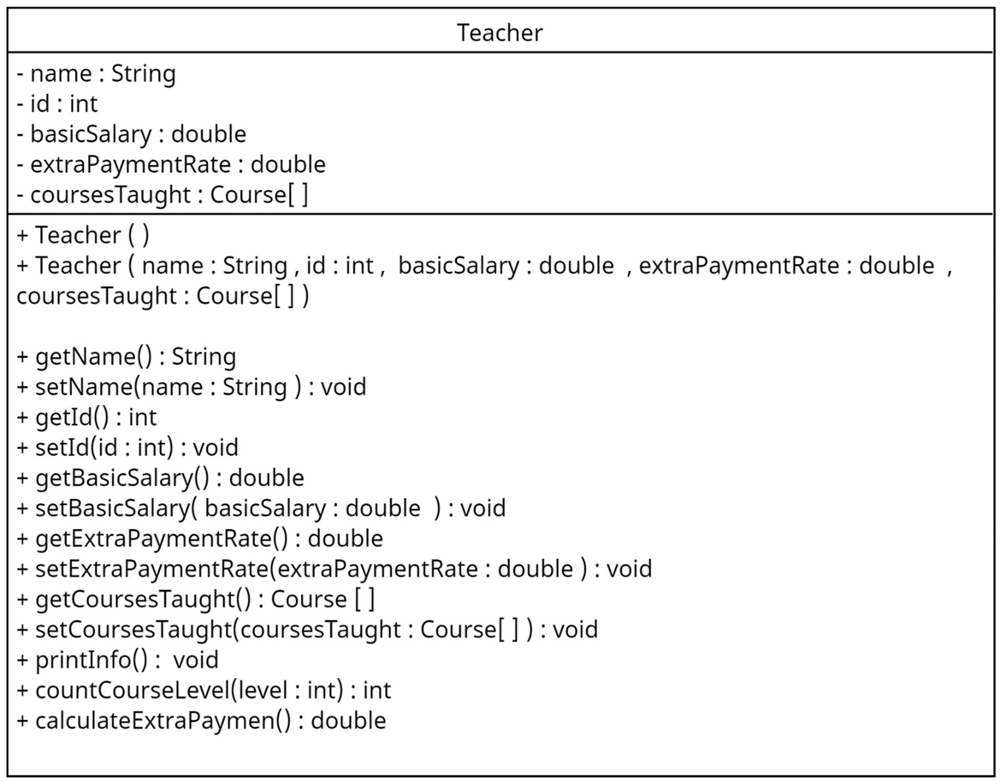
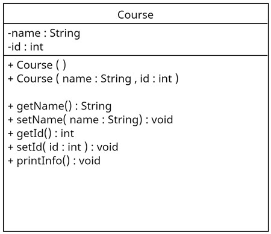

# 🎓 Teacher - Course Management System

 An object-oriented Java application designed to manage teachers, their assigned courses, and calculate their total salaries, including extra payments.

## 📚 Table of Contents

- [ Overview](#-overview)
- [ Features](#-features)
- [ Class Structure](#️-class-structure)
- [ Getting Started](#-getting-started)
  - [ Prerequisites](#️-prerequisites)
  - [ Installation](#-installation)
- [ Usage](#-usage)
- [ UML Diagram](#-uml-diagram)

## 📖 Overview

This system allows for efficient management of teacher information, including their personal details, courses they teach, and salary calculations based on course levels and extra payment rates. It provides a user-friendly menu to perform various operations related to teachers and their courses.

## ✨ Features

- **Teacher Management**: Add and update teacher information such as name, ID, basic salary, and extra payment rate.
- **Course Management**: Assign courses to teachers, specifying course names and IDs.
- **Salary Calculation**: Compute total salaries, including extra payments based on course levels.
- **User Menu**:
  1. Print teacher information by ID.
  2. Display all teachers' names and total salaries.
  3. Modify a teacher's basic salary.
  4. Show the sum of all teachers' total salaries.
  5. Exit the application.

## 🏗️ Class Structure

The system comprises two primary classes:

1. **Course**:
   - Attributes:
     - `name`: Department short name (e.g., "COMP").
     - `id`: Course ID (e.g., 2310).
   - Methods:
     - Constructors: Default and parameterized.
     - Getters and setters for all attributes.
     - `printInfo()`: Displays course details.

2. **Teacher**:
   - Attributes:
     - `name`: Teacher's name.
     - `id`: Teacher's ID number.
     - `basicSalary`: Base salary.
     - `extraPaymentRate`: Rate for extra payments.
     - `coursesTaught`: Array of `Course` objects.
   - Methods:
     - Constructors: Default and parameterized.
     - Getters and setters for all attributes.
     - `printInfo()`: Displays teacher details.
     - `countCourseLevel(int level)`: Returns the number of courses at a specified level.
     - `calculateExtraPayment()`: Computes extra payment based on courses taught.

The `Main` class serves as the driver, facilitating user interaction through a menu-driven interface.

## 🚀 Getting Started

### 🛠️ Prerequisites

- Java Development Kit (JDK)
- Eclipse IDE

### 📦 Installation

1. **Clone the repository**:

   ```bash
   git clone https://github.com/osaidnur/Teacher-Course-Management-System.git
   ```

2. **Import the project into Eclipse**:
   - Open Eclipse.
   - Select `File` > `Import` > `Existing Projects into Workspace`.
   - Choose the cloned repository folder.
   - Click `Finish`.

## 🧪 Usage

1. **Run the application**:
   - In Eclipse, navigate to the `Main` class.
   - Right-click and select `Run As` > `Java Application`.

2. **Interact with the menu**:
   - Follow on-screen prompts to add teachers, assign courses, and perform various operations as per the provided menu options.

## 🧭 UML Diagram

Below are the UML diagrams for the `Teacher` and `Course` classes:

<p align="center">
  
  
</p>
